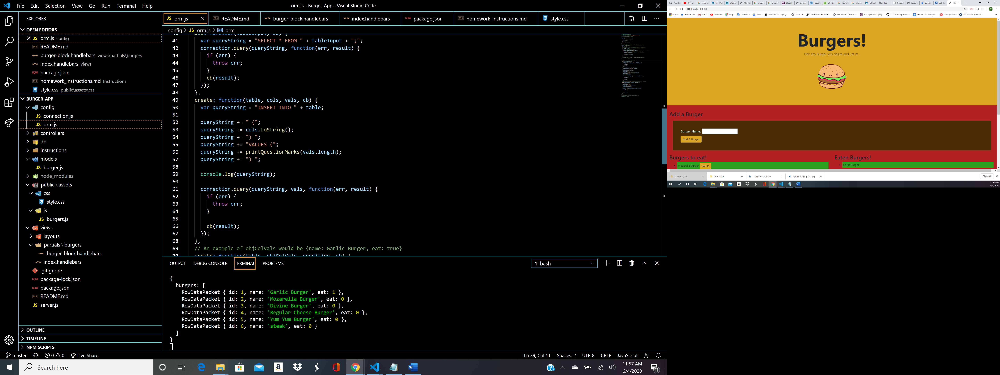

# Burger_App
Project with -MVC

Project Title
The Burger APP is a Java Script ORM based application that lets Users eat any burger they desire.
The application gives the User to the option to create a burger by adding it to it to Eat list and once the User clicks on eat it! The burger will shift to another list called Eaten. The application contains a lot of dynamic code by using MySQL,ORM's, express and handlebars. 

Getting Started
You can get a verison of this product up and running through heroku and can see the juicy backend code through the github
page.

Prerequisites
Install
Express
Express Handlebars
Handlebars-helper-css
MySQL
Nodemon

Deployment
Heroku

Try Me Live
<a href="https://secret-fortress-26536.herokuapp.com/">https://secret-fortress-26536.herokuapp.com/</a>

Built With
Bootstrap
Jquery
HTML5 
CSS3
Node
JS
Express
Express Handlebars
Handlebars-helper-css 
MySQL 
Nodemon

Authors
Wadih Ojeil- Full Stack Web Developer

License
This project is licensed under the MIT License

## Purpose and Inspiration
Eat as many burgers as you desire. Full Restful Crud experience with handlebars Express and MySQL

## Tech Stack
+ [Personal ORM] 
+ [EXPRESS](https://www.npmjs.com/package/express)
+ [EXPRESS Handlebars](https://www.npmjs.com/package/express-handlebars)
+ [NODE](https://nodejs.org/en/)

#### Install and run
Install all the dependencies with NPM
`npm install`  
Then start the project
`node server.js`
